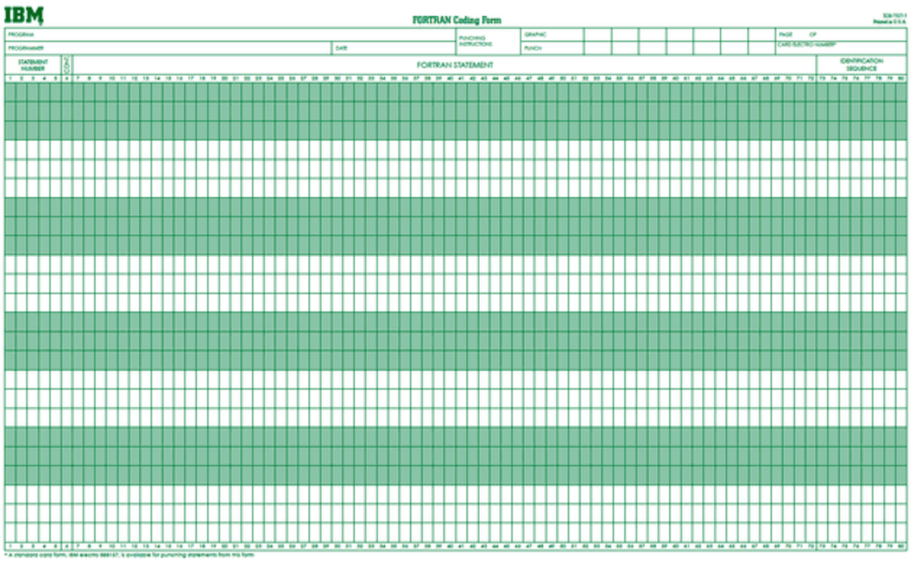

## 玩转Linux操作系统

### 操作系统发展史

只有硬件没有软件的计算机系统被称之为“裸机”，我们很难用“裸机”来完成计算机日常的工作（如存储和运算），所以必须用特定的软件来控制硬件的工作。最靠近计算机硬件的软件是系统软件，其中最为重要的就是“操作系统”。“操作系统”是控制和管理整个计算机系统的硬件和软件资源，合理的分配资源和调配任务，为系统用户和其他软件提供接口和环境的程序的集合。

#### 没有操作系统（手工操作）

在计算机诞生之初没有操作系统的年代，人们先把程序纸带（或卡片）装上计算机，然后启动输入机把程序和送入计算机，接着通过控制台开关启动程序运行。当程序执行完毕，打印机输出计算的结果，用户卸下并取走纸带（或卡片）。第二个用户上机，重复同样的步骤。在整个过程中用户独占机器，CPU等待手工操作，资源利用率极低。下图是IBM生产的书写Fortran程序的80栏打孔卡，当然这个已经是比较先进的打孔卡了。



#### 批处理系统

首先启动计算机上的一个监督程序，在监督程序的控制下，计算机能够自动的、成批的处理一个或多个用户的作业。完成一批作业后，监督程度又从输入机读取作业存入磁带机。按照上面的步骤重复处理任务。监督程序不停的处理各个作业，实现了作业的自动转接，减少了作业的建立时间和手工操作时间，提高了计算机资源的利用率。 批处理系统又可以分为单道批处理系统、多道批处理系统、联机批处理系统、脱机批处理系统。

#### 分时系统和实时系统

分时系统是把处理器的运行时间分成很短的时间片，按时间片轮流把处理机分配给各联机作业使用。 若某个作业在分配给它的时间片内不能完成其计算，则该作业暂时中断，把处理机让给另一作业使用，等待下一轮调度时再继续其运行。由于计算机速度很快，作业运行轮转得很快，给每个用户的感觉是他独占了一台计算机。而每个用户可以通过自己的终端向系统发出各种操作控制命令，在充分的人机交互情况下，完成作业的运行。为了解决分时系统不能及时响应用户指令的情况，又出现了能够在在严格的时间范围内完成事件处理，及时响应随机外部事件的实时系统。

#### 通用操作系统

1. 1960s：IBM的System/360系列的机器有了统一的操作系统OS/360。

2. 1965年：AT&T的贝尔实验室加入GE和MIT的合作计划开始开发MULTICS。

3. 1969年：Ken Tompson为了玩“Space Travel”游戏用汇编语言在PDP-7上开发了Unics。

   

4. 1970年~1971年：Ken Tompson和Dennis Ritchie用B语言重写了Unics，并在Brian Kernighan的建议下将其更名为Unix。

   

5. 1972年~1973年：Dennis Ritchie发明了C语言来取代可移植性较差的B语言，并开启了用C语言重写Unix的工作。

6. 1974年：Unix推出了里程碑意义的第5版。

7. 1979年：从Unix第7版开始，AT&T发布新的使用条款，将Unix私有化。

8. 1987年：Andrew S. Tanenbaum教授为了能在课堂上教授学生操作系统运作的细节，决定在不使用任何AT&T的源代码前提下，自行开发与Unix兼容的操作系统，以避免版权上的争议并将其命名为Minix。

9. 1991年：Linus Torvalds就读于芬兰赫尔辛基大学期间，尝试在Minix上做一些开发工作，但因为Minix只是作为教学用途的功能并不强，为了方便在学校的主机的新闻组和邮件系统中读写和下载文件，Linus编写了磁盘驱动程序和文件系统，这些成为了Linux系统内核的雏形。

   Ken L. Thompson (ken)

   Dennis M. Ritchie (DMR)

   Andrew S. Tanenbaum (ast)

   Linus B. Torvalds

下图是Unix操作系统家族的图谱。


### Linux概述

Linux是一个通用操作系统。一个操作系统要负责任务调度、内存分配、处理外围设备I/O等操作。操作系统通常由内核（运行其他程序，管理像磁盘、打印机等硬件设备的核心程序）和系统程序（设备驱动、底层库、shell、服务程序等）两部分组成。

Linux内核是芬兰人Linus Torvalds开发的，于1991年9月发布。而Linux操作系统作为Internet时代的产物，它是由全世界许多开发者共同合作开发的，是一个自由的操作系统（注意自由和免费并不是同一个概念，想了解二者的差别可以[点击这里](https://www.debian.org/intro/free)）。

### Linux系统优点

1. 通用操作系统，不跟特定的硬件绑定。
2. 用C语言编写，有可移植性，有内核编程接口。
3. 支持多用户和多任务，支持安全的分层文件系统。
4. 大量的实用程序，完善的网络功能以及强大的支持文档。
5. 可靠的安全性和良好的稳定性，对开发者更友好。

### Linux系统发行版本

1. [Redhat](https://www.redhat.com/en)
2. [Ubuntu](https://www.ubuntu.com/)
3. [CentOS](https://www.centos.org/)
4. [Fedora](https://getfedora.org/)
5. [Debian](https://www.debian.org/)
6. [openSUSE](https://www.opensuse.org/)

### 基础命令

Linux系统的命令通常都是如下所示的格式：

```Shell

命令名称 [命名参数] [命令对象]
```

1. 获取登录信息 - **w** / **who** / **last**。

   ```Shell
   
   [root@izwz97tbgo9lkabnat2lo8z ~]# w
    23:31:16 up 12:16,  2 users,  load average: 0.00, 0.01, 0.05
   USER     TTY      FROM             LOGIN@   IDLE   JCPU   PCPU WHAT
   root     pts/0    182.139.66.250   23:03    4.00s  0.02s  0.00s w
   jackfrue pts/1    182.139.66.250   23:26    3:56   0.00s  0.00s -bash
   [root@izwz97tbgo9lkabnat2lo8z ~]# who
   root     pts/0        2018-04-12 23:03 (182.139.66.250)
   jackfrued pts/1        2018-04-12 23:26 (182.139.66.250)
   [root@izwz97tbgo9lkabnat2lo8z ~]# who am i
   root     pts/0        2018-04-12 23:03 (182.139.66.250)
   ```

2. 查看自己使用的Shell - **ps**。

   Shell也被称为“壳”，它是用户与内核交流的翻译官，简单的说就是人与计算机交互的接口。目前很多Linux系统默认的Shell都是bash（<u>B</u>ourne <u>A</u>gain <u>SH</u>ell），因为它可以使用Tab键进行命令补全、可以保存历史命令、可以方便的配置环境变量以及执行批处理操作等。

   ```Shell
   
   [root@izwz97tbgo9lkabnat2lo8z ~]# ps
     PID TTY          TIME CMD
    3531 pts/0    00:00:00 bash
    3553 pts/0    00:00:00 ps
   ```

3. 查看命令的说明 - **whatis**。

   ```Shell
   
   [root@izwz97tbgo9lkabnat2lo8z ~]# whatis ps
   ps (1)        - report a snapshot of the current processes.
   [root@izwz97tbgo9lkabnat2lo8z ~]# whatis python
   python (1)    - an interpreted, interactive, object-oriented programming language
   ```

4. 查看命令的位置 - **which** / **whereis**。

   ```Shell
   
   [root@izwz97tbgo9lkabnat2lo8z ~]# whereis ps
   ps: /usr/bin/ps /usr/share/man/man1/ps.1.gz
   [root@izwz97tbgo9lkabnat2lo8z ~]# whereis python
   python: /usr/bin/python /usr/bin/python2.7 /usr/lib/python2.7 /usr/lib64/python2.7 /etc/python /usr/include/python2.7 /usr/share/man/man1/python.1.gz
   [root@izwz97tbgo9lkabnat2lo8z ~]# which ps
   /usr/bin/ps
   [root@izwz97tbgo9lkabnat2lo8z ~]# which python
   /usr/bin/python
   ```

5. 查看帮助文档 - **man** / **info** / **apropos**。
   ```Shell
   
   [root@izwz97tbgo9lkabnat2lo8z ~]# ps --help
   Usage:
    ps [options]
    Try 'ps --help <simple|list|output|threads|misc|all>'
     or 'ps --help <s|l|o|t|m|a>'
    for additional help text.
   For more details see ps(1).
   [root@izwz97tbgo9lkabnat2lo8z ~]# man ps
   PS(1)                                User Commands                                PS(1)
   NAME
          ps - report a snapshot of the current processes.
   SYNOPSIS
          ps [options]
   DESCRIPTION
   ...
   [root@izwz97tbgo9lkabnat2lo8z ~]# info ps
   ...
   ```

6. 切换用户 - **su**。

   ```Shell
   
   [root@izwz97tbgo9lkabnat2lo8z ~]# su hellokitty
   [hellokitty@izwz97tbgo9lkabnat2lo8z root]$
   ```

7. 以管理员身份执行命令 - **sudo**。

   ```Shell
   
   [jackfrued@izwz97tbgo9lkabnat2lo8z ~]$ ls /root
   ls: cannot open directory /root: Permission denied
   [jackfrued@izwz97tbgo9lkabnat2lo8z ~]$ sudo ls /root
   [sudo] password for jackfrued:
   calendar.py  code  error.txt  hehe  hello.c  index.html  myconf  result.txt
   ```

   > **说明**：如果希望用户能够以管理员身份执行命令，用户必须被添加到sudoers名单中，该文件在 `/etc`目录下。

8. 登入登出相关 - **logout** / **exit** / **adduser** / **userdel** / **passwd** / **ssh**。

   ```Shell
   
   [root@izwz97tbgo9lkabnat2lo8z ~]# adduser hellokitty
   [root@izwz97tbgo9lkabnat2lo8z ~]# passwd hellokitty
   Changing password for user jackfrued.
   New password:
   Retype new password:
   passwd: all authentication tokens updated successfully.
   [root@izwz97tbgo9lkabnat2lo8z ~]# ssh hellokitty@1.2.3.4
   hellokitty@1.2.3.4's password:
   Last login: Thu Apr 12 23:05:32 2018 from 10.12.14.16
   [hellokitty@izwz97tbgo9lkabnat2lo8z ~]$ logout
   Connection to 1.2.3.4 closed.
   [root@izwz97tbgo9lkabnat2lo8z ~]#
   ```

9. 查看系统和主机名 - **uname** / **hostname**。

   ```Shell
   
   [root@izwz97tbgo9lkabnat2lo8z ~]# uname
   Linux
   [root@izwz97tbgo9lkabnat2lo8z ~]# hostname
   izwz97tbgo9lkabnat2lo8z
   [root@iZwz97tbgo9lkabnat2lo8Z ~]# cat /etc/centos-release
   CentOS Linux release 7.4.1708 (Core) 
   ```

10. 重启和关机 - **reboot** / **init 6** / **shutdown** / **init 0**。

11. 查看历史命令 - **history**。

    ```Shell
    
    [root@iZwz97tbgo9lkabnat2lo8Z ~]# history
    ...
    452  ls
    453  cd Python-3.6.5/
    454  clear
    455  history
    [root@iZwz97tbgo9lkabnat2lo8Z ~]# !454
    ```

    > 说明：查看到历史命令之后，可以用`!历史命令编号`来重新执行该命令。

### 实用程序

#### 文件和文件夹操作

1. 创建/删除目录 - **mkdir** / **rmdir**。

2. 创建/删除文件 - **touch** / **rm**。

   - touch命令用于创建空白文件或修改文件时间。在Linux系统中一个文件有三种时间：
     - 更改内容的时间（mtime）
     - 更改权限的时间（ctime）
     - 最后访问时间（atime）

3. 切换和查看当前工作目录 - **cd** / **pwd**。

4. 查看目录内容 - **ls**。

5. 查看文件内容 - **cat** / **head** / **tail** / **more** / **less**。

6. 拷贝/移动文件 - **cp** / **mv**。

7. 查看文件及内容 - **find** / **grep**。

   ```Shell
   
   [root@izwz97tbgo9lkabnat2lo8z ~]# find -name *.html
   ./index.html
   ./code/index.html
   [root@izwz97tbgo9lkabnat2lo8z ~]# find . -atime 7 -type f -print
   [root@izwz97tbgo9lkabnat2lo8z ~]# find . -type f -size +2k
   [root@izwz97tbgo9lkabnat2lo8z ~]# find . -type f -name "*.swp" -delete
   [root@izwz97tbgo9lkabnat2lo8z ~]# grep "<script>" . -R -n
   ./index.html:15:                <script>
   ./code/index.html:2884: <script>
   ./code/foo.html:2:<!--STATUS OK--><html> <head><meta ...
   ```

8. 符号链接 - **ln**。

9. 压缩和归档 - **gzip** / **gunzip** / **xz** / **tar**。

10. 其他工具 - **sort** / **uniq** / **diff** / **tr** / **cut** / **paste** / **file** / **wc**。

#### 管道和重定向

1. 管道的使用 - **\|**。

   例子：查找当前目录下文件个数。

   ```Shell
   
   [root@iZwz97tbgo9lkabnat2lo8Z ~]# find ./ | wc -l
   6152
   ```

   例子：列出当前路径下的文件和文件夹，给每一项加一个编号。

   ```Shell
   
   [root@iZwz97tbgo9lkabnat2lo8Z ~]# ls | cat -n
        1  dump.rdb
        2  mongodb-3.6.5
        3  Python-3.6.5
        4  redis-3.2.11
        5  redis.conf
   ```

   例子：查找record.log中包含AAA，但不包含BBB的记录的总数

   ```Shell
   
   [root@iZwz97tbgo9lkabnat2lo8Z ~]# cat record.log | grep AAA | grep -v BBB | wc -l
   ```

2. 输出重定向和错误重定向 - **\>** / **>>** / **2\>**。

   ```Shell
   
   [root@iZwz97tbgo9lkabnat2lo8Z ~]# cat ReadMe.txt
   banana
   apple
   grape
   apple
   grape
   watermelon
   pear
   pitaya
   [root@iZwz97tbgo9lkabnat2lo8Z ~]# cat ReadMe.txt | sort | uniq > Result.txt
   [root@iZwz97tbgo9lkabnat2lo8Z ~]# cat Result.txt
   apple
   banana
   grape
   pear
   pitaya
   watermelon
   ```

3. 输入重定向 - **\<**。

#### 别名

1. **alias**

   ```Shell
   
   [root@iZwz97tbgo9lkabnat2lo8Z ~]# alias ll='ls -l'
   [root@iZwz97tbgo9lkabnat2lo8Z ~]# alias frm='rm -rf'
   [root@iZwz97tbgo9lkabnat2lo8Z ~]# ll
   ...
   drwxr-xr-x  2 root       root   4096 Jun 20 12:52 abc
   ...
   [root@iZwz97tbgo9lkabnat2lo8Z ~]# frm abc
   ```

2. **unalias**

   ```Shell
   
   [root@iZwz97tbgo9lkabnat2lo8Z ~]# unalias frm
   [root@iZwz97tbgo9lkabnat2lo8Z ~]# frm sohu.html
   -bash: frm: command not found
   ```

#### 其他程序

1. 时间和日期 - **date** / **cal**。

   ```Shell
   
   [root@iZwz97tbgo9lkabnat2lo8Z ~]# date
   Wed Jun 20 12:53:19 CST 2018
   [root@iZwz97tbgo9lkabnat2lo8Z ~]# cal
         June 2018
   Su Mo Tu We Th Fr Sa
                   1  2
    3  4  5  6  7  8  9
   10 11 12 13 14 15 16
   17 18 19 20 21 22 23
   24 25 26 27 28 29 30
   [root@iZwz97tbgo9lkabnat2lo8Z ~]# cal 5 2017
         May 2017
   Su Mo Tu We Th Fr Sa
       1  2  3  4  5  6
    7  8  9 10 11 12 13
   14 15 16 17 18 19 20
   21 22 23 24 25 26 27
   28 29 30 31
   ```

2. 录制操作脚本 - **script**。

3. 给用户发送消息 - **mesg** / **write** / **wall** / **mail**。

   ```Shell
   
   
   ```

   

### 文件系统

#### 文件和路径

1. 命名规则
2. 扩展名
3. 隐藏文件
4. 工作目录和主目录
5. 绝对路径和相对路径

#### 目录结构

1. /bin - 基本命令的二进制文件。
2. /boot - 引导加载程序的静态文件。
3. /dev - 设备文件。
4. **/etc** - 配置文件。
5. /home - 普通用户主目录的父目录。
6. /lib - 共享库文件。
7. /lib64 - 共享64位库文件。
8. /lost+found - 存放未链接文件。
9. /media - 自动识别设备的挂载目录。
10. /mnt - 临时挂载文件系统的挂载点。
11. /opt - 可选插件软件包安装位置。
12. /proc -  内核和进程信息。
13. **/root** - 超级管理员用户主目录。
14. /run - 存放系统运行时需要的东西。
15. /sbin - 超级用户的二进制文件。
16. /sys - 设备的伪文件系统。
17. /tmp - 临时文件夹。
18. **/usr** - 用户应用目录。
19. /var - 变量数据目录。

#### 访问权限

1. **chmod** - 改变文件模式比特。

   ```Shell
   
   [root@iZwz97tbgo9lkabnat2lo8Z ~]# ls -l
   ...
   -rw-r--r--  1 root       root 211878 Jun 19 16:06 sohu.html
   ...
   [root@iZwz97tbgo9lkabnat2lo8Z ~]# chmod g+w,o+w sohu.html
   [root@iZwz97tbgo9lkabnat2lo8Z ~]# ls -l
   ...
   -rw-rw-rw-  1 root       root 211878 Jun 19 16:06 sohu.html
   ...
   [root@iZwz97tbgo9lkabnat2lo8Z ~]# chmod 644 sohu.html
   [root@iZwz97tbgo9lkabnat2lo8Z ~]# ls -l
   ...
   -rw-r--r--  1 root       root 211878 Jun 19 16:06 sohu.html
   ...
   ```
   > 说明：通过上面的例子可以看出，用`chmod`改变文件模式比特有两种方式：一种是字符设定法，另一种是数字设定法。除了`chmod`之外，可以通过`umask`来设定哪些权限将在新文件的默认权限中被删除。

   > 附：长格式查看目录或文件时显示结果及其对应权限的数值如下表所示。
   > | 文件类型  | 所有者权限                     | 同组用户权限                    | 其他用户权限                    |
   > | --------- | ------------------------------ | ------------------------------- | ------------------------------- |
   > | d（目录） | r    w   x<br>读 写  执行<br>7 | r    -   x<br>读      执行<br>5 | r    -   x<br>读      执行<br>5 |
   > | -（文件） | r    w  -<br>读 写<br>6        | r    -   -<br>读<br>4           | r    -   -<br>读<br>4           |
   > | l（链接） | r    w   x<br>读 写  执行<br>7 | r    w   x<br>读 写  执行<br>7  | r    -   x<br>读      执行<br>5 |


2. **chown** - 改变文件所有者。

    ```Shell
       
    [root@iZwz97tbgo9lkabnat2lo8Z ~]# ls -l
    ...
    -rw-r--r--  1 root root     54 Jun 20 10:06 ReadMe.txt
    ...
    [root@iZwz97tbgo9lkabnat2lo8Z ~]# chown hellokitty ReadMe.txt
    [root@iZwz97tbgo9lkabnat2lo8Z ~]# ls -l
    ...
    -rw-r--r--  1 hellokitty root     54 Jun 20 10:06 ReadMe.txt
    ...
    ```

#### 磁盘管理

1. 列出文件系统的磁盘使用状况 - **df**。
2. 磁盘分区表操作 - **fdisk**。
3. 格式化文件系统 - **mkfs**。
4. 文件系统检查 - **fsck**。
5. 挂载/卸载 - **mount** / **umount**。

### 编辑器vim

1. 启动和退出

2. 命令模式和编辑模式

3. 光标操作

4. 文本操作

5. 查找和替换

   - /正则表达式
   - :n1,n2s/正则表达式/替换后的内容/gice
     - g - global
     - i - ignore case
     - c - confirm
     - e - error

6. 参数设定

   - :set ts=4
   - :set nu
   - :syntax on

7. 高级技巧

   - 映射快捷键
     - inoremap key:...
   - 录制宏
     - 在命令模式下输入`qa`开始录制宏（也可以是`qb`、`qc`、`qd`）
     - 执行你的操作，这些操作都会被录制下来
     - 如果要录制的操作完成了，按`q`结束录制
     - 通过`@a`播放宏（`1000@a` - 将宏播放1000次）

### 环境变量

1. HOME
2. SHELL
3. HISTSIZE
4. RANDOM
5. PATH

### 软件安装和配置

#### yum

- yum update
- yum install
- yum remove
- yum list
- yum search

#### rpm

- rpm -ivh \-\-force \-\-nodeps
- rpm -e 
- rpm -qa | grep

#### 源代码构建安装

- Makefile
- make && make install

#### 实例

1. 安装MySQL。
2. 安装Redis。
3. 安装NginX。

### 进程和性能

1. pmap
2. sar
3. free
4. iostat
5. gprof

### 配置服务

1. systemctl start / stop / restart / status
2. systemctl enable / disable
3. 计划任务 - **crontab**。
4. 开机自启。

### 网络访问和管理

1. 通过网络获取资源 - **wget**。
   - -b 后台下载模式
   - -O 下载到指定的目录
   - -r 递归下载
2. 显示/操作网络配置（旧） - **ipconfig**。
3. 显示/操作网络配置（新） - **ip**。
4. 网络可达性检查 - **ping**。
5. 查看网络服务和端口 - **netstat**。
6. 安全文件拷贝 - **scp**。
7. 安全文件传输 - **sftp**。

### Shell和Shell编程

1. 通配符。
2. 后台运行。

### 其他内容

1. awk
2. sed
3. xargs