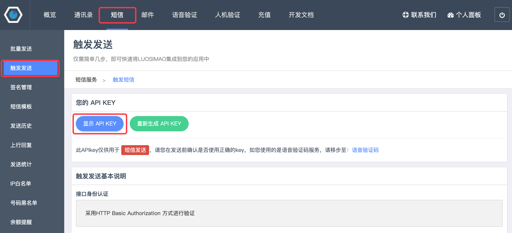

## 接入三方平台

在Web应用的开发过程中，有一些任务并不是我们自己能够完成的。例如，我们的Web项目中需要做个人或企业的实名认证，很显然我们并没有能力判断用户提供的认证信息的真实性，这个时候我们就要借助三方平台提供的服务来完成该项操作。再比如说，我们的项目中需要提供在线支付功能，这类业务通常也是借助支付网关来完成而不是自己去实现，我们只需要接入像微信、支付宝、银联这样的三方平台即可。

在项目中接入三方平台基本上就两种方式：API接入和SDK接入。

1. API接入指的是通过访问三方提供的URL来完成操作或获取数据。国内有很多这样的平台提供了大量常用的服务，例如[聚合数据](https://www.juhe.cn/)上提供了生活服务类、金融科技类、交通地理类、充值缴费类等各种类型的API。我们可以通过Python程序发起网络请求，通过访问URL获取数据，这些API接口跟我们项目中提供的数据接口是一样的，只不过我们项目中的API是供自己使用的，而这类三方平台提供的API是开放的。当然开放并不代表免费，大多数能够提供有商业价值的数据的API都是需要付费才能使用的。
2. SDK接入指的是通过安装三方库并使用三方库封装的类、函数来使用三方平台提供的服务的方式。例如我们刚才说到的接入支付宝，就需要先安装支付宝的SDK，然后通过支付宝封装的类和方法完成对支付服务的调用。

下面我们通过具体的例子来讲解如何接入三方平台。

### 接入短信网关

一个Web项目有很多地方都可以用到短信服务，例如：手机验证码登录、重要消息提醒、产品营销短信等。要实现发送短信的功能，可以通过接入短信网关来实现，国内比较有名的短信网关包括：云片短信、网易云信、螺丝帽、SendCloud等，这些短信网关一般都提供了免费试用功能。下面我们以[螺丝帽](https://luosimao.com/)平台为例，讲解如何在项目中接入短信网关，其他平台操作基本类似。

1. 注册账号，新用户可以免费试用。

2. 登录到管理后台，进入短信版块。

3. 点击“触发发送”可以找到自己专属的API Key（身份标识）。

    

4. 点击“签名管理”可以添加短信签名，短信都必须携带签名，免费试用的短信要在短信中添加“【铁壳测试】”这个签名，否则短信无法发送。

    

5. 点击“IP白名单”将运行Django项目的服务器地址（公网IP地址，本地运行可以打开[xxx]()网站查看自己本机的公网IP地址）填写到白名单中，否则短信无法发送。

    

6. 如果没有剩余的短信条数，可以到“充值”页面选择“短信服务”进行充值。

    

接下来，我们可以通过调用螺丝帽短信网关实现发送短信验证码的功能，代码如下所示。

```Python
def send_mobile_code(tel, code):
    """发送短信验证码"""
    resp = requests.post(
        url='http://sms-api.luosimao.com/v1/send.json',
        auth=('api', 'key-自己的APIKey'),
        data={
            'mobile': tel,
            'message': f'您的短信验证码是{code}，打死也不能告诉别人哟。【Python小课】'
        },
        verify=False
    )
    return resp.json()
```

运行上面的代码需要先安装`requests`三方库，这个三方库封装了HTTP网络请求的相关功能，使用起来非常的简单，我们在之前的内容中也讲到过这个三方库。`send_mobile_code`函数有两个参数，第一个参数是手机号，第二个参数是短信验证码的内容，第5行代码需要提供自己的API Key，就是上面第2步中查看到的自己的API Key。请求螺丝帽的短信网关会返回JSON格式的数据，对于上面的代码如果返回`{'err': 0, 'msg': 'ok'}`，则表示短信发送成功，如果`err`字段的值不为`0`而是其他值，则表示短信发送失败，可以在螺丝帽官方的[开发文档](https://luosimao.com/docs/api/)页面上查看到不同的数值代表的含义，例如：`-20`表示余额不足，`-32`表示缺少短信签名。

可以在视图函数中调用上面的函数来完成发送短信验证码的功能，稍后我们可以把这个功能跟用户注册结合起来。

生成随机验证码和验证手机号的函数。

```Python
import random
import re

TEL_PATTERN = re.compile(r'1[3-9]\d{9}')


def check_tel(tel):
    """检查手机号"""
    return TEL_PATTERN.fullmatch(tel) is not None


def random_code(length=6):
    """生成随机短信验证码"""
    return ''.join(random.choices('0123456789', k=length))
```

发送短信验证码的视图函数。

```Python
@api_view(('GET', ))
def get_mobilecode(request, tel):
    """获取短信验证码"""
    if check_tel(tel):
        redis_cli = get_redis_connection()
        if redis_cli.exists(f'vote:block-mobile:{tel}'):
            data = {'code': 30001, 'message': '请不要在60秒内重复发送短信验证码'}
        else:
            code = random_code()
            send_mobile_code(tel, code)
            # 通过Redis阻止60秒内容重复发送短信验证码
            redis_cli.set(f'vote:block-mobile:{tel}', 'x', ex=60)
            # 将验证码在Redis中保留10分钟（有效期10分钟）
            redis_cli.set(f'vote2:valid-mobile:{tel}', code, ex=600)
            data = {'code': 30000, 'message': '短信验证码已发送，请注意查收'}
    else:
        data = {'code': 30002, 'message': '请输入有效的手机号'}
    return Response(data)
```

> **说明**：上面的代码利用Redis实现了两个额外的功能，一个是阻止用户60秒内重复发送短信验证码，一个是将用户的短信验证码保留10分钟，也就是说这个短信验证码的有效期只有10分钟，我们可以要求用户在注册时提供该验证码来验证用户手机号的真实性。

### 接入云存储服务

